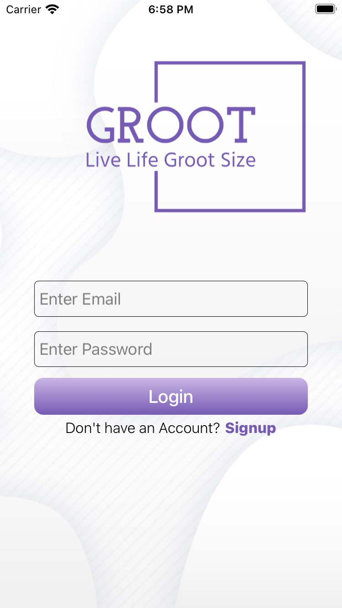
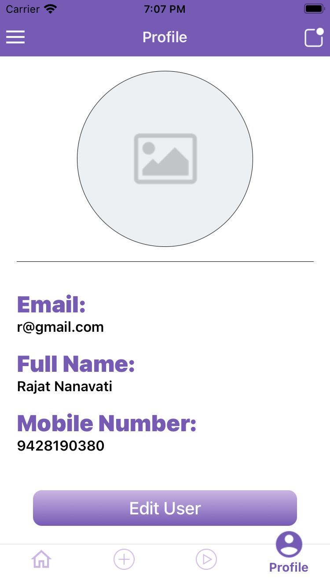
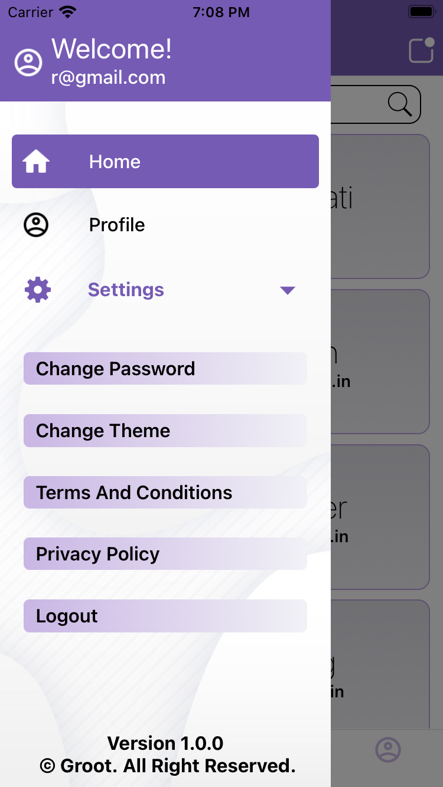

# rn-groot

[](https://choosealicense.com/licenses/mit/)


Explore and test fundamental react-native modules and libraries with Groot! This application is your gateway to discover and experiment with various features, including 🚀 API data fetching, 🔍 API data searching, 📜 pagination, 🗺️ navigation, 🎨 theme change, 🎥 video integration, 👤 profile management, 📷 image uploading, 🔑 password changing, and integration of third-party libraries like 🖊️ KeyboardAwareScrollView, 🌐 WebView, 🌈 LinearGradient, and more.
Experience the power of multi-user functionality with a robust signup and login module and experience with Groot's interactive playground for React Native development. 📱💡

# Screenshots

<div style="display: flex; justify-content: center;">
  
        
    
    
</div>

More screenshots available [here](https://imgur.com/a/DYwand9).

# Features

- 👥✍️ Signup and login module
- 🔄 State management using Redux
- 🚀 API data fetching
- 🔍 Local data searching
- 📜 Pagination
- 🗺️ Navigation
- 🎨 Theme customization
- 🎥 Video integration
- 👤 Profile management
- 📷 Image uploading
- 🔑 Password changing
- 🖊️ Integration of third-party libraries (e.g., KeyboardAwareScrollView, WebView, LinearGradient)

# Installation

Clone the project to your device using `git clone https://github.com/rajat258/rn-groot.git`

#### Install node-modules

```bash
  cd rn-groot
  npm i
```

#### Note: Make sure your rvm version is 2.7.6

```bash
  rvm use 2.7.6
```

#### Setup Bundle install

```bash
  bundle install
```

#### Setup Permission handler on iOS

```bash
  npx react-native setup-ios-permissions
```

### For iOS Installation

```bash
  cd ios && pod install
```

### For Android Installation

No Installation required.

# Run Project

```bash
  npx react-native start
```

# API Reference

API used for this project: https://reqres.in/

# Troubleshooting

If application is not working for android devices follow procedures mentioned below:

- Open Android Studio
- Files > Sync Project with Gradle Files
- Build > Clean Project
- Build > Rebuild Project

# Color Reference

| Color              | Hex                                                              |
| ------------------ | ---------------------------------------------------------------- |
| Primary Color      |  #BE9FE1 |
| Dark Primary Color |  #755bb4 |
| Secondary Color    |  #C9B6E4 |
| Accent 100 Color   |  #E1CCEC |
| Accent 200 Color   |  #F1F1F6 |

## Authors

- [@rajat258](https://github.com/rajat258)

## Support

For support, email rajatnanavati258@gmail.com
